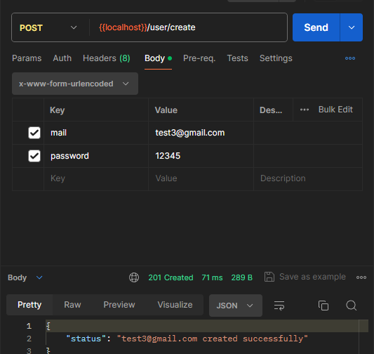
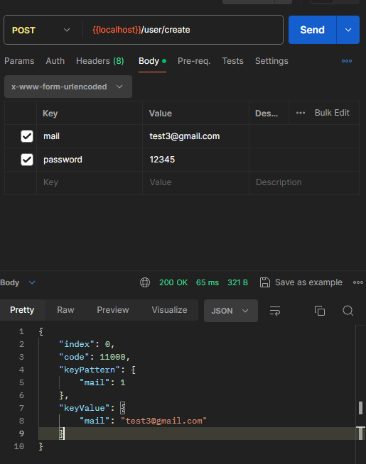
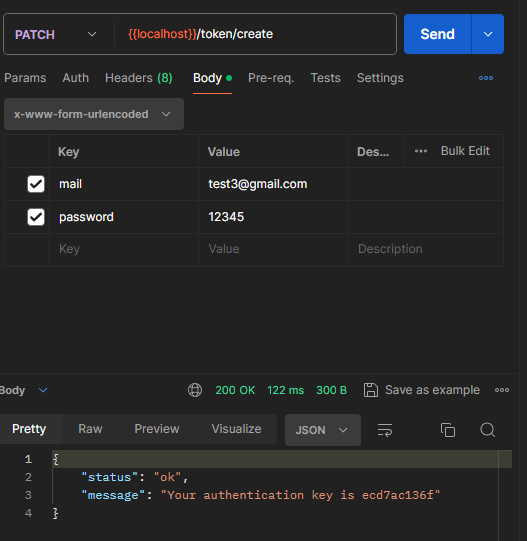
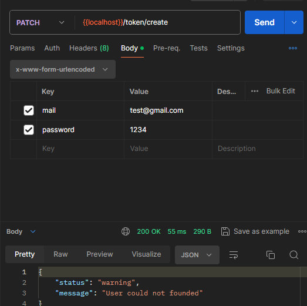
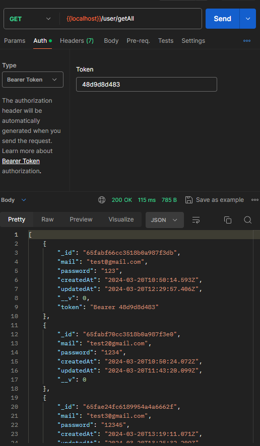
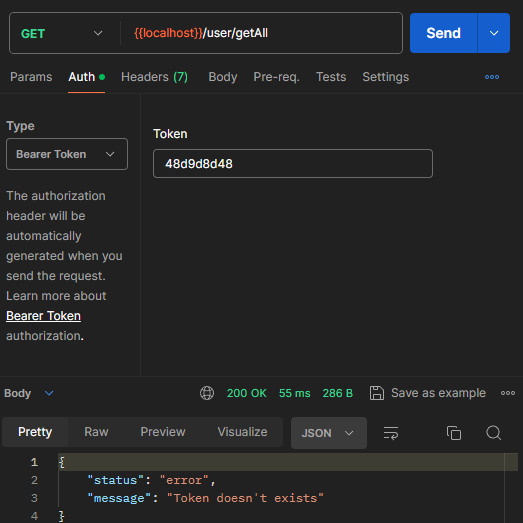

**post** `/user/create` creates user and body must contain **email and password**.

---

if you try to create an user with same email api doesn't accept this request.

---

**patch** `/token/create` creates token for user and body must contain **email and password**.

---

if you use an account that don't created you'll see a response like this.

---
**get** `/user/getAll` fetch all user data from databases but requires bearer token which we already created earlier.

---
if you enter your token wrong or don't enter any you are not able to see all user data.

